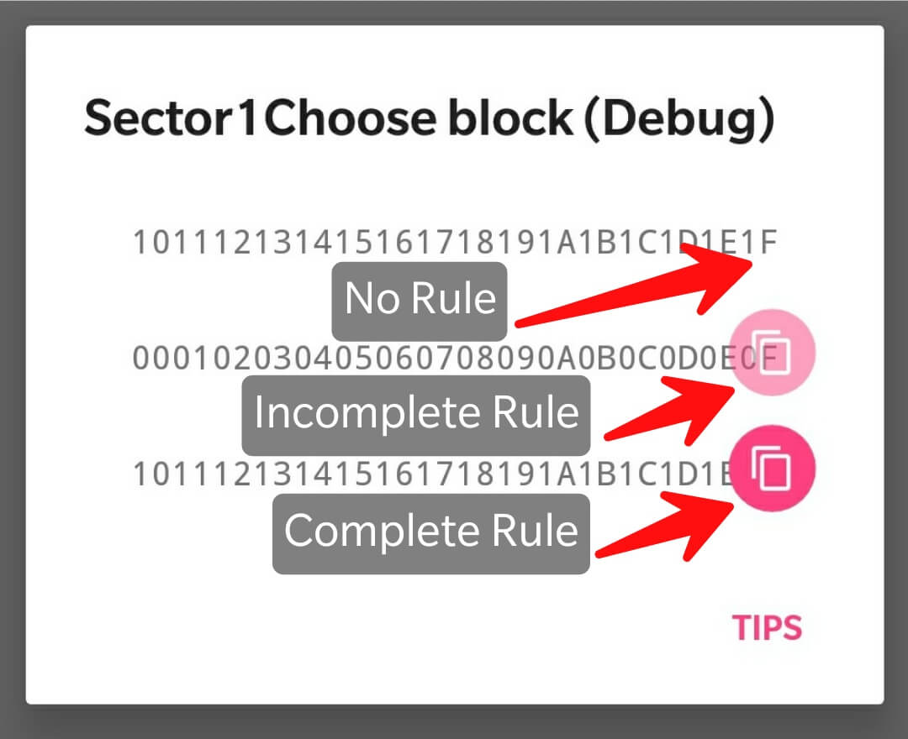
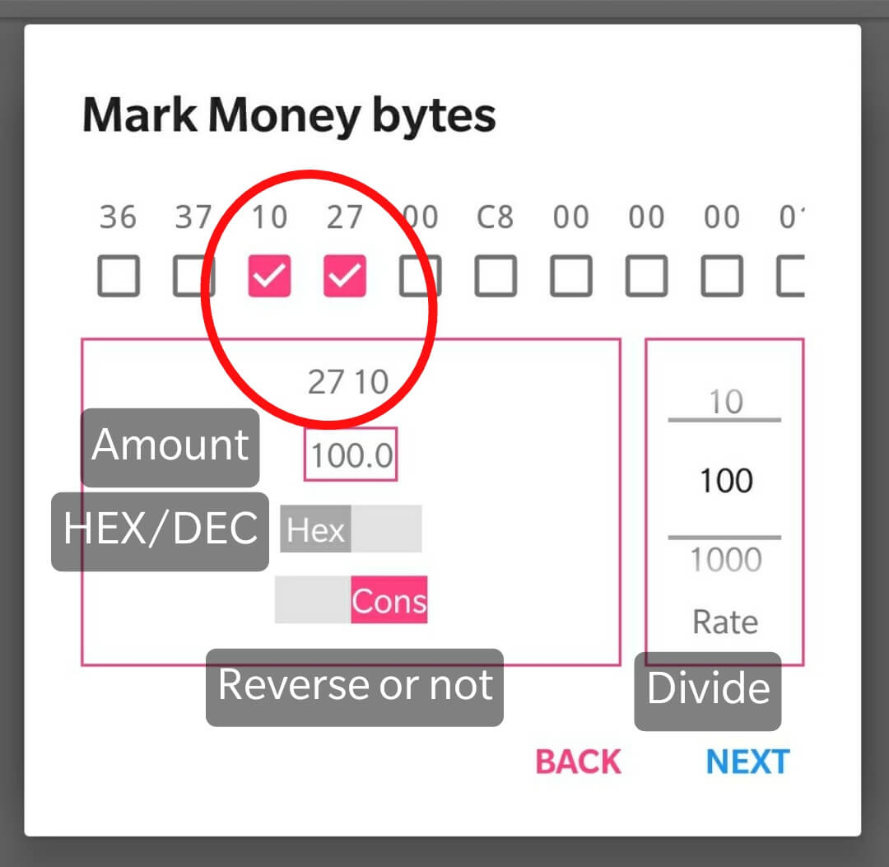
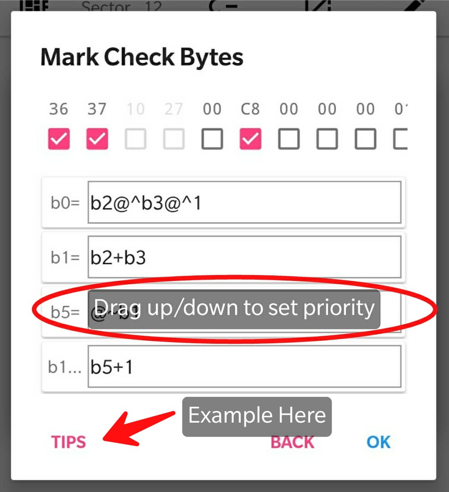

[Select Language](../index.html)  

# 1.Overview
Here is a Material Design APP to make charge `Mifare Classic Card` easily.  
Attention:  
1. `Mifare 1K `Supported Device.  
(Or OTG support `ACR122U`)
2. KeyA and keyB of useful sector. 
3. Comply with local laws, only used for study and testing.

# 2.Tutorial
## 2.1 Lists
### 2.1.1 Add Card
Click the **+ floating button** will display `Add Card Dialog`, put the Mifare Classic Card close to the NFC antenna, then you can add a card to the APP.
### 2.1.2 Remove Card
Slide the item toward right to remove the card.
### 2.1.3 Sort Card
Press and drag to sort Cards.
## 2.2 Details
### 2.2.0 Interface Introduction  

### 2.2.1 Add Key
Click the ** + floating button ** to display `Add Key Dialog`, select the sector number by sliding the picker, and enter 6 bytes (12 digits or letters) valid key A or key B, click ` Complete ` to save.
### 2.2.2 Modify Key
Click the ** modify button ** will display the `Modify Key Dialog`,  select new  sector number by sliding the picker, and modify the 6 bytes (12 digits or letters) valid key A or key B, click ` Complete `save new keys or sector.
### 2.2.3 Read Sector
After the card is close to the NFC antenna, click on the ** read button ** will read 4 block of data from clicked sector, you could modify and write the new data.  
### 2.2.4 Data Sniff/Compare
Must add correct keys before. After marked, it can be  compared with highlight datas.  
[Pro Version] Data Backups/Restore, Compare vertically, Rule Repository.  
### 2.2.5 Add Rule 
### 2.2.5.0 Interface Introduction   
Click data item to add/modify rule.  
Click icon to copy rule to another block of another sector.  
[Pro Version] Rule copy.

#### 2.2.5.1 Add Money Byte
Mark the byte, then verify the money is correct, and click Next.  
. 
#### 2.2.5.2 Add Checked Byte    
Check the bytes that changes and add expressions. Make sure that it's correct then click OK.  

##### 2.2.5.2.1 Supported operations:
> And: +  
> Subtraction: -  
> Multiply: *  
> division: /  
> xor: @^  
> not: @~  
   

*Note: Only decimal arithmetic is supported*    
**Get Expressions Example [Click Here](./help_add_rules.html)**  

##### 2.2.5.2.2 Sort Expressions 
Press and drag to sort Expressions.   
The calculation is from top to the end.

### 2.2.6 Sort Keys
Press and drag to sort Keys.
###	2.2.7 Remove Key
Slide the item toward right to remove the key.
### 2.2.8 key Lists 
Long press the floating button to show key lists.  
## 2.3 Charge
### 2.3.1 Set Quotas
Long press **the Charge TextView** , you can charge as the Quotas. 
### 2.3.2 Clear Record
Long press **the recharge record list**, then pop up the dialog will allow you to to clear the recharge record or not.  
### 2.3.3 Show Calculate Result 
Long press the floating button to preview the data generated on **Rule**.

# 3.Debug  
Long press the floating button to enable debugging features.
- 【Lists】Add a card by click the icon of `Add card dialog`me     

# 4.Dependency  
Thanks for the friends on the contribution of open source community, regardless of rank.  
- `ikarus23` [MifareClassicTool](https://github.com/ikarus23/MifareClassicTool "MifareClassicTool")  
- `afollestad` [material-dialogs](https://github.com/afollestad/material-dialogs "material-dialogs")  
- `markormesher` [android-fab](https://github.com/markormesher/android-fab)  
- `didikee` [AndroidDonate](https://github.com/didikee/AndroidDonate "AndroidDonate")  
- `Ice-Box` [Ice-Box](http://catchingnow.com)  
