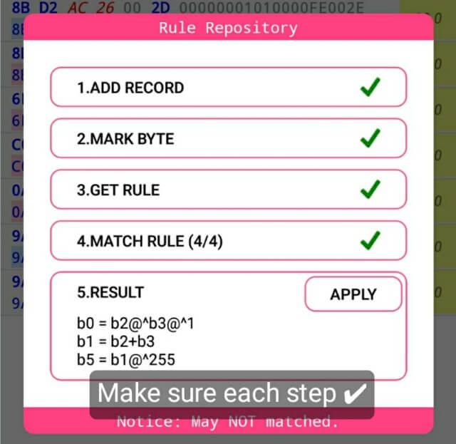
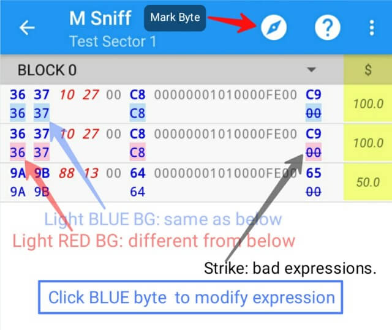

- [Add data] Put card close to NFC antenna.

- [Sort] Drag **↓** or **↑** to sort.

- [Delete] Swipe**→** to remove.

- [Backup] Click **+** select upload icon.*

- [Restore] Click **+** select download icon.*

- [Repository] Click **+** select Repo. icon, get step bellow.**
  
- [Caculation] Caculate Check Byte on Expression, like the picture bellow.**
  