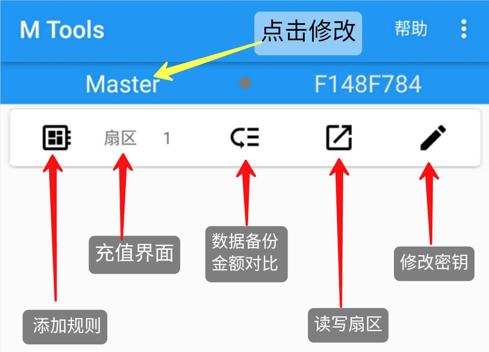
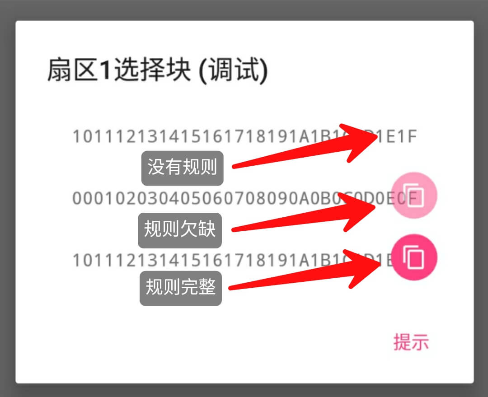
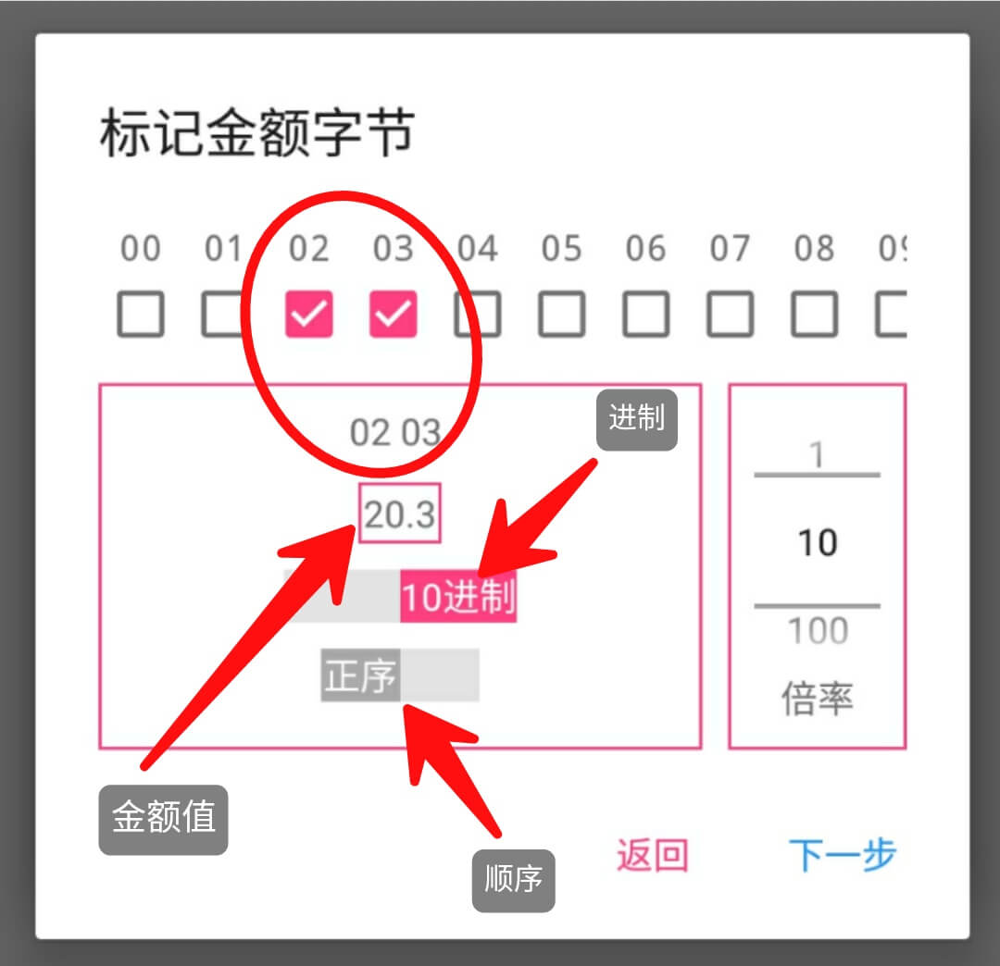
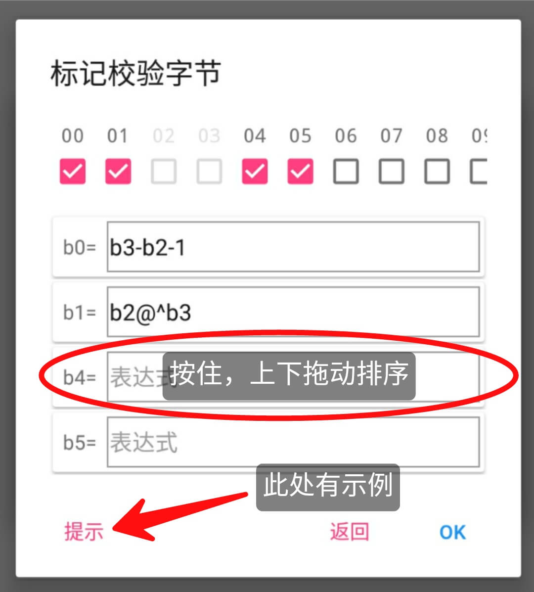

[Select Language](../index.html)

# 0.更新

最后更新 `2018/12/27`

[更新日志](./update_log.html)

# 1.概览

一个使`Mifare卡片`充值更快捷的应用。  
请确保以下3点：

1. 设备支持`Mifare Classic 1K Card`  
(或支持OTG连接`ACR122U`)
2. 已知卡片的有效扇区的密钥keyA和keyB
3. 遵守当地法律，仅供学习测试使用  

# 2.向导  
[如何使用MTools](./how_to_use_mtools.html)  
---
## 2.1 列表  
### 2.1.1 添加卡片  
点击**+浮动按钮**后将显示`添加卡片对话框`，将Mifare Classic卡片紧贴NFC天线，即可添加卡片到APP。

### 2.1.2 卡片排序
按住并上下拖动即可重新排序。
### 2.1.3 删除卡片
向右滑动对应项目即可删除。
## 2.2 详情  
### 2.2.0 界面标识  

### 2.2.1 添加密钥
点击**+浮动按钮**后将显示`添加密钥对话框`，通过滑动选择扇区序号，并输入6字节(共12位数字或字母)有效密钥A或密钥B，点击`完成`保存。
### 2.2.2 修改密钥
点击**修改按钮**后将显示`修改密钥对话框`，通过滑动选择修改扇区序号，并修改6字节(共12位数字或字母)有效密钥A或密钥B，点击`完成`保存新密钥或扇区。
### 2.2.3 读写扇区
将卡片紧贴NFC天线后，点击**读取按钮**后将读取该扇区对应4个块的数据，可修改数据并`写入`新数据。 
若密钥修改，将同步保存新密钥。  
### 2.2.4 数据对比  
需已知密钥，标记字节后，可高亮对比数据与金额。  
【付费功能】数据备份，垂直对比，规则仓库。
### 2.2.5 添加规则  
#### 2.2.5.0 界面标识  
点击数据添加规则  
点击图标复制规则  
【付费功能】规则复制  

#### 2.2.5.1 添加金额字节
标记金额对应的字节，并调节参数，确认金额无误后，下一步  
  
#### 2.2.5.2 添加校验字节
勾选校验字节，即变化的字节，添加表达式，无误后点击OK保存  
  
##### 2.2.5.2.1 表达式  
支持算法：
> 加: +  
> 减：-  
> 乘：*  
> 除：/  
> 按位异或: @^  
> 按位取反: @~  


*注意：仅支持十进制数字运算*  
**查看表达式示例 [请点击](./help_add_rules.html)**  
##### 2.2.5.3.2 表达式排序
```  按住并上下拖动即可重新排序，靠上先计算

```
### 2.2.6 扇区排序
按住并上下拖动即可重新排序。
### 2.2.7 扇区密钥
向右滑动对应项目即可删除。
###  2.2.8 预览密钥列表
长按浮动按钮即可。
## 2.3 充值
### 2.3.1 设置定额
长按标题下的**充值**文字按钮，即可设定为定额充值。
### 2.3.2 清除记录
长按充值记录，即可弹出对话框选择是否清空充值记录。
### 2.3.3 预览计算结果
长按浮动按钮，可预览由 **规则** 生成的数据。

# 3.调试  
可开启浮动按钮的其他功能等，包括：  
- 【列表】点击`添加卡片对话框`中心NFC图标可添加卡片，UID为本设备UID前4字节  

# 4.依赖
感谢以下网友对开源社区的贡献，排名不分先后。  
- `ikarus23` [MifareClassicTool](https://github.com/ikarus23/MifareClassicTool)  
- `afollestad` [material-dialogs](https://github.com/afollestad/material-dialogs)  
- `markormesher` [android-fab](https://github.com/markormesher/android-fab)  
- `didikee` [AndroidDonate](https://github.com/didikee/AndroidDonate)  
- `Ice-Box`[Ice-Box](http://catchingnow.com)  

# 5.教程  
以下教程来自网友
- [教程1: 水卡充值](tutorial/tutorial_0.html)   
- [教程2: 对比分析HEX数据](tutorial/tutorial_compare_hex_data.html)

*欢迎投稿*